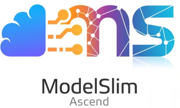

  

# 欢迎来到 msModelSlim 

MindStudio ModelSlim（昇腾模型压缩工具，msModelSlim），一个以加速为目标、压缩为技术、昇腾为根本的亲和压缩工具。包含量化和压缩等一系列推理优化技术，旨在加速大语言稠密模型、MoE模型、多模态理解模型、多模态生成模型等。 :computer:

昇腾 AI 开发者可通过调用 msModelSlim 提供的丰富 Python API，灵活实现算法适配与模型压缩，支持多种格式的权重导出及全流程的精度、性能调优。经过优化后的模型可无缝接入 MindIE、vLLM Ascend 等主流推理框架，在昇腾 AI 处理器上实现高效部署。 :zap:

## :star: 核心优势

*   **高效压缩** :package: —— 支持多种量化算法，显著降低显存占用。
*   **昇腾亲和** :processor: —— 深度适配昇腾硬件，确保最佳推理性能。
*   **简单易用** :magic_wand: —— 丰富的模型最佳实践库，快速实现模型优化。

## :loudspeaker: 最新消息
### 2025年12月
- msModelSlim 支持量化精度反馈自动调优，可根据精度需求自动搜索最优量化配置
- msModelSlim 支持自主量化多模态理解模型，支持多模态理解模型的量化接入
- msModelSlim 一键量化支持多卡量化，支持分布式逐层量化，提升大模型量化效率
- msModelSlim 支持 DeepSeek-V3.2 W8A8 量化，单卡64G显存、100G内存即可执行
- msModelSlim 支持 DeepSeek-V3.2-Exp W4A8 量化，单卡64G显存、100G内存即可执行
- msModelSlim 支持 Qwen3-VL-235B-A22B W8A8 量化

### 2025年11月
- msModelSlim 模型适配支持插件化和配置注册，支持依赖预检

### 2025年10月
- msModelSlim 支持 Qwen3-235B-A22B W4A8、Qwen3-30B-A3B W4A8 量化。vLLM Ascend已支持量化模型推理部署 部署指导

### 2025年9月
- msModelSlim 支持 DeepSeek-V3.2-Exp W8A8 量化，单卡64G显存，100G内存即可执行
- msModelSlim 现已解决Qwen3-235B-A22B在W8A8量化下频繁出现"游戏副本"等异常token的问题 Qwen3-MoE 量化推荐实践
- msModelSlim 支持DeepSeek R1 W4A8 per-channel 量化【Prototype】
- msModelSlim 支持大模型量化敏感层分析

### 2025年8月
- msModelSlim 支持 Wan2.1 模型一键量化
- msModelSlim 支持大模型逐层量化，显著降低大模型量化内存占用
- msModelSlim 支持大模型 SSZ 权重量化算法，通过迭代搜索最优缩放因子和偏移量提升量化精度

> 注： **Prototype**特性未经过充分验证，可能存在不稳定和bug问题，**beta**表示非商用特性

## msModelSlim Documentation

Welcome to the msModelSlim documentation. msModelSlim is a comprehensive model compression and optimization tool for Ascend AI processors.

