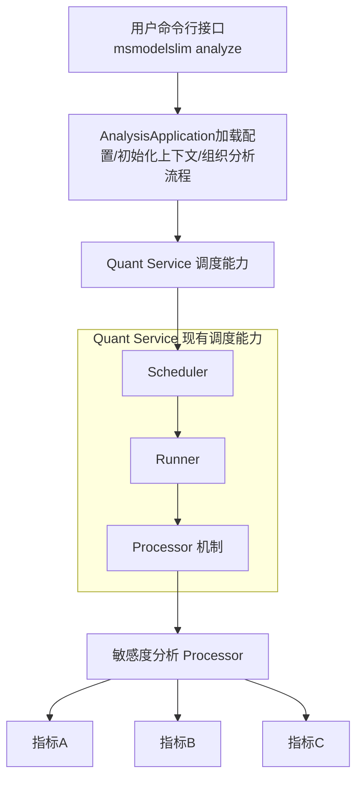

**msModelSlim 敏感层分析模块重构特性设计说明书**

<table>
    <tr>
        <td>所属SIG组:</td>
        <td>msit</td>
    </tr>
    <tr>
        <td>落入版本:</td>
        <td>26.0.0</td>
    </tr>
    <tr>
        <td>设计人员:</td>
        <td>libowen</td>
    </tr>
    <tr>
        <td>日期:</td>
        <td>20260122</td>
    </tr>
</table>

**Copyright © 2026 msModelSlim Community**

您对"本文档"的复制，使用，修改及分发受知识共享(Creative Commons)署名—相同方式共享4.0国际公共许可协议(以下简称"CC BY-SA 4.0")的约束。
为了方便用户理解，您可以通过访问<https://creativecommons.org/licenses/by-sa/4.0/>了解CC BY-SA 4.0的概要 (但不是替代)。
CC BY-SA 4.0的完整协议内容您可以访问如下网址获取：<https://creativecommons.org/licenses/by-sa/4.0/legalcode>。

**改版记录**

<table>
    <tr>
        <th>日期</th>
        <th>修订版本</th>
        <th>修订描述</th>
        <th>作者</th>
        <th>审核</th>
    </tr>
    <tr>
        <td>20260122</td>
        <td>1.0.0</td>
        <td>文档创建</td>
        <td>libowen</td>
        <td>panyj1993</td>
    </tr>
</table>


**目录**

1.特性概述

1.1范围

1.2特性需求列表

2.需求场景分析

2.1特性需求来源与价值概述

2.2特性场景分析

2.3特性影响分析

2.3.1硬件限制

2.3.2技术限制

2.3.3对License的影响分析

2.3.4对系统性能规格的影响分析

2.3.5对系统可靠性规格的影响分析

2.3.6对系统兼容性的影响分析

2.3.7与其他重大特性的交互性，冲突性的影响分析

2.4同类社区/商用软件实现方案分析

3.特性/功能实现原理

3.1目标

3.2总体方案

4.Use Case实现

4.1 Use Case描述

4.2特性设计思路

4.3约束条件

4.4详细实现(从用户入口的模块级别或进程级别消息序列图)

4.5子系统间接口(主要覆盖模块接口定义)

4.6子系统详细设计

4.7DFX属性设计

4.7.1性能设计

4.7.2升级与扩容设计

4.7.3异常处理设计

4.7.4资源管理相关设计

4.7.5小型化设计

4.7.6可测性设计

4.7.7安全设计

4.8系统外部接口

4.9自测用例设计

5.可靠性&可用性设计

5.1冗余设计

5.2故障管理

5.3过载控制设计

5.4升级不中断业务

5.5人因差错设计

5.6故障预测预防设计

6.特性非功能性质量属性相关设计

6.1可测试性

6.2可服务性

6.3可演进性

6.4开放性

6.5兼容性

6.6可伸缩性/可扩展性

6.7可维护性

6.8资料

7.数据结构设计（可选）

8.参考资料清单

**表目录**

表1：特性需求列表

表2：安全设计确认表

表3：资料修改清单

**图目录**

图1：方案总体实现原理图

**List of abbreviations**  **缩略语清单** ：

<table>
    <tr>
        <th>Abbreviations 缩略语</th>
        <th>Full spelling 英文全名</th>
        <th>Chinese explanation 中文解释</th>
    </tr>
    <tr>
        <td>MHA</td>
        <td>Multi-Head Attention</td>
        <td>多头注意力机制</td>
    </tr>
    <tr>
        <td>MLA</td>
        <td>Multi-Head Latent Attention</td>
        <td>多头潜在注意力机制</td>
    </tr>
    <tr>
        <td>DSA</td>
        <td>Distributed Sparse Attention</td>
        <td>分布式稀疏注意力机制</td>
    </tr>
    <tr>
        <td>SWA</td>
        <td>Sliding Window Attention</td>
        <td>滑动窗口注意力机制</td>
    </tr>
    <tr>
        <td>NPU</td>
        <td>Neural Processing Unit</td>
        <td>神经网络处理单元</td>
    </tr>
    <tr>
        <td>YAML</td>
        <td>YAML Ain't Markup Language</td>
        <td>YAML标记语言</td>
    </tr>
    <tr>
        <td>MD5</td>
        <td>Message Digest Algorithm 5</td>
        <td>消息摘要算法5</td>
    </tr>
</table>

# 1.特性概述

敏感层分析用于识别模型量化流程中的关键层与关键结构，辅助用户理解量化敏感度并制定优化策略。当前已存在独立的敏感层分析服务实现，同时量化服务具备统一的调度与执行机制。本特性旨在将敏感层分析从独立实现升级为可调度、可复用、可扩展的服务化能力。

本次重构的价值主要体现在：1）统一调度入口，降低维护成本；2）对齐量化流程，使敏感度分析具备一致的上下文与配置能力；3）为后续算法扩展提供标准化载体。

本文档描述敏感层分析模块重构的设计意图、总体方案与使用场景，重点强调调度化与算法化的抽象能力，适用于msModelSlim工具的研发、测试与维护人员。

## 1.1范围

本特性围绕敏感层分析模块重构，主要包含以下功能点：

1. **调度化重构**：复用量化服务的调度机制，统一敏感层分析的执行编排。
2. **流程对齐**：敏感度分析支持与量化流程一致的逐层调度与上下文管理。
3. **算法抽象**：引入可插拔的processor与敏感度指标框架，支持线性层与attention结构的敏感度分析。

**注意**：现有敏感层分析功能不变，重构是实现方式升级，具体分析算法的细节不在本特性范围内。

## 1.2特性需求列表

表1：特性需求列表

<table>
    <tr>
        <th>需求编号</th>
        <th>需求名称</th>
        <th>特性描述</th>
        <th>备注</th>
    </tr>
    <tr>
        <td>1</td>
        <td>敏感层分析调度化</td>
        <td>通过复用量化服务调度机制，实现敏感层分析的统一入口与执行编排</td>
        <td>计划实现</td>
    </tr>
    <tr>
        <td>2</td>
        <td>分析流程与量化对齐</td>
        <td>支持逐层调度与量化感知上下文，使敏感度分析可嵌入量化流程</td>
        <td>计划实现</td>
    </tr>
    <tr>
        <td>3</td>
        <td>敏感度算法框架</td>
        <td>支持线性层、attention结构与多指标敏感度计算的框架化扩展</td>
        <td>计划实现</td>
    </tr>
</table>

# 2.需求场景分析

## 2.1特性需求来源与价值概述

当前敏感层分析已具备一套独立的服务实现，但与量化服务存在调度体系与流程割裂的问题。随着量化能力持续演进，敏感层分析需要更紧密地融入量化流程，支持统一的调度、配置与扩展方式。重构后的敏感层分析将从独立实现升级为调度与算法结合的统一能力，减少重复建设并提升协作效率。

## 2.2特性场景分析

### 场景触发条件及对象

1. **触发条件**：
   - 用户需要在量化前或量化过程中识别敏感层
   - 用户希望比较不同层或结构的敏感度差异
   - 用户希望敏感度分析与量化流程一致执行

2. **使用对象**：
   - 模型量化工程师：关注量化方案与敏感层定位
   - 算法工程师：关注敏感度指标与可解释性

3. **使用接口**：
   - 命令行接口：与量化工具一致的入口
   - 配置文件：统一的YAML配置方式

### 主要应用场景

1. **量化前敏感度评估场景**：
   - 在量化前进行敏感层分析，形成候选层列表
   - 关注点为层级排序与整体趋势

2. **量化中逐层分析场景**：
   - 在量化流程中逐层调度敏感度评估
   - 关注点为流程一致性与调度稳定性

3. **算法迭代评估场景**：
   - 不同敏感度指标或processor对比
   - 关注点为可扩展性与结果一致性

## 2.3特性影响分析

敏感层分析模块重构与以下模块存在交互：

1. **敏感层分析服务模块**：既有实现为独立服务，重构后与量化服务共享调度
2. **量化服务模块**：复用调度与执行框架，提供流程上下文
3. **处理器框架模块**：作为敏感度算法的承载与扩展载体
4. **配置与元数据模块**：统一配置入口与参数管理
5. **日志与结果管理模块**：统一输出与可追溯性

### 与其他需求及特性的交互分析

1. **与量化特性的交互**：敏感层分析依赖量化服务的调度机制，二者需要保持接口与配置一致
2. **与评估特性的交互**：敏感度结果可能被评估流程引用，需要数据格式与结果结构对齐
3. **与模型适配器的交互**：需要模型适配器提供结构信息与层级描述

### 平台差异性分析

1. **硬件平台**：依赖NPU环境的量化执行能力
2. **操作系统**：支持Linux操作系统，需要Python 3.8+

### 兼容性分析

1. **配置兼容性**：新接口兼容既有敏感层分析配置格式
2. **接口兼容性**：保留原有调用方式的兼容层

### 约束及限制

1. **模型支持限制**：仅支持已适配的模型类型与结构描述
2. **流程耦合限制**：部分敏感度算法需依赖量化上下文

### 2.3.1硬件限制

1. **NPU设备要求**：需要支持模型量化与推理的NPU设备
2. **内存要求**：敏感度分析需要额外的内存开销，建议至少32GB
3. **存储要求**：需要存储分析结果与中间数据，建议至少50GB可用空间

**规避方案**：
- 对于资源不足的情况，可以减少分析层数或降低分析频次

### 2.3.2技术限制

**操作系统**：Linux

**编程语言**：Python 3.8+

**依赖框架**：
- PyTorch：模型加载与量化依赖
- 量化服务组件：提供调度与执行环境

**规避方案**：
- 对于依赖版本不兼容的情况，参考安装指南使用指定版本

### 2.3.3对License的影响分析

本特性不引入新的第三方组件，仍沿用现有依赖体系，不会对项目License合规性造成影响。

### 2.3.4对系统性能规格的影响分析

敏感层分析的性能开销随分析粒度与指标类型变化，整体属于可控范围。重构后通过调度与并行机制可降低单次分析的整体耗时。

### 2.3.5对系统可靠性规格的影响分析

重构后敏感层分析与量化流程一致执行，需要保证调度失败可隔离，分析结果可重入，不影响量化主流程的可靠性。

### 2.3.6对系统兼容性的影响分析

新实现保持对既有配置与调用方式的兼容性，不影响存量用户的使用行为。

### 2.3.7与其他重大特性的交互性，冲突性的影响分析

1. **与量化流程的交互**：共享调度与上下文，需保持接口一致
2. **与自动调优的交互**：敏感度结果可能被调优策略引用，需要统一数据结构

## 2.4同类社区/商用软件实现方案分析

常见实现模式包括独立敏感度分析模块与量化流程内嵌分析两类方案。独立方案实现简单但难以复用调度与流程；内嵌方案一致性更强但对框架要求更高。本特性选择在量化服务调度框架内实现敏感度分析，以兼顾一致性与扩展性。

# 3.特性/功能实现原理

## 3.1目标

敏感层分析模块重构的目标包括：

1. **调度统一**：敏感层分析具备与量化服务一致的调度入口与执行机制
2. **流程对齐**：敏感度分析可融入量化流程，支持逐层调度
3. **算法扩展**：敏感度算法以processor与指标方式扩展，支持多结构分析
4. **兼容性保证**：对外保持兼容，内部实现可替换

## 3.2总体方案

总体方案通过复用量化服务的调度机制重构敏感层分析服务，核心要点如下：

1. **调度复用**：在量化服务框架内增加敏感度分析调度流程
2. **处理器抽象**：敏感度算法以processor形式组织，支持线性层与attention结构
3. **指标统一**：敏感度打分采用统一指标接口，支持可组合扩展

### 硬件选择

- **NPU设备**：依赖NPU进行量化与分析的统一执行

### 算法选择

- **敏感度指标**：采用可插拔指标框架，支持多种敏感度评估方式
- **结构适配**：对线性层与attention结构提供通用适配能力

### 架构布局

敏感层分析在架构上对齐量化服务的分层设计：

1. **应用层**：提供统一入口与执行编排
2. **调度层**：负责逐层调度与上下文管理
3. **算法层**：processor与指标实现敏感度分析
4. **数据层**：结果与元数据统一管理

### Use Case分解

1. **Use Case：基于调度和算法实现的敏感层分析功能**

### 对接原则

1. **接口标准化**：调度接口与量化服务一致
2. **数据格式统一**：敏感度结果采用统一结构
3. **错误处理规范**：与量化服务日志与异常处理一致

### 方案整体架构图



图1：方案总体实现原理图

# 4.Use Case实现

## 4.1 Use Case描述

**Use Case名称**：基于调度和算法实现的敏感层分析功能

**Use Case场景**：
- 用户希望通过统一入口触发敏感层分析
- 系统复用量化服务调度机制进行执行
- 分析过程与量化流程具备一致的上下文
- 用户需要对线性层与attention结构进行敏感度评估
- 用户希望使用多指标对敏感度结果进行评价

**对敏感层分析功能的影响**：
- 需要提供统一调度入口
- 需要对分析流程进行调度化改造
- 需要结构适配与指标扩展能力

**实现的特性**：敏感层分析统一实现

## 4.2特性设计思路

通过引入调度层与统一入口，将敏感层分析纳入量化服务的调度体系，避免独立实现的流程重复与配置分裂。

## 4.3约束条件

1. **配置一致性要求**：分析配置与量化配置保持一致的结构与解析方式
2. **调度依赖**：分析流程依赖量化服务的调度组件
3. **兼容性要求**：保留原有分析入口的兼容逻辑

## 4.4详细实现(从用户入口的模块级别或进程级别消息序列图)

### 处理流程

```
用户启动敏感层分析
    │
    ▼
AnalysisApplication.run()
    │
    ▼
调度层初始化上下文
    │
    ├─→ 加载配置
    ├─→ 解析分析任务
    └─→ 注册processor与指标
    │
    ▼
逐层调度执行敏感度分析
    │
    ├─→ 识别层类型与结构
    ├─→ 选择并执行敏感度processor
    ├─→ 指标子类计算敏感度评分
    └─→ 汇总结果并输出
```

### 模块交互说明

1. **AnalysisApplication**：统一入口与流程编排
2. **调度框架**：复用量化服务调度能力
3. **敏感度processor**：执行分析算法
4. **指标模块**：计算与汇总敏感度结果

## 4.5子系统间接口(主要覆盖模块接口定义)

### 新增接口

1. **AnalysisDispatchConfig**：
   - 类型：配置模型
   - 功能：定义敏感层分析调度参数

2. **SensitivityProcessor**：
   - 类型：抽象接口
   - 功能：定义敏感度分析processor统一入口

3. **SensitivityMetric**：
   - 类型：抽象接口
   - 功能：定义敏感度指标的输入与输出

### 修改接口

1. **量化调度入口**：
   - 功能扩展：支持敏感层分析调度任务注册

## 4.6子系统详细设计

### 4.6.1 调度适配设计

调度适配通过统一配置与上下文传递，将敏感层分析纳入量化服务的调度生命周期，避免单独维护执行逻辑。

### 4.6.2 Processor组织方式

processor按层类型与结构类型组织，可组合执行，支持按需扩展与替换。

### 4.6.3 结构适配与指标扩展

通过结构描述对象与指标注册机制，支持线性层与attention结构的敏感度分析与多指标评分。

## 4.7DFX属性设计

### 4.7.1性能设计

1. **调度开销**：调度开销可控，不影响原有量化流程
2. **分析开销**：分析粒度可配置，支持按需降低开销

### 4.7.2升级与扩容设计

1. **配置兼容性**：新配置兼容旧接口
2. **扩展性**：processor与指标可扩展

### 4.7.3异常处理设计

1. **调度失败处理**：记录日志并隔离单层失败
2. **分析异常处理**：错误不影响主流程

### 4.7.4资源管理相关设计

分析过程复用量化服务资源管理机制，确保资源申请与释放一致。

### 4.7.5小型化设计

小型化版本可关闭敏感层分析调度，减少额外资源消耗。

### 4.7.6可测性设计

测试重点覆盖调度入口、processor加载、指标计算与结果汇总等基础能力。

### 4.7.7安全设计

敏感层分析不涉及新增对外接口或敏感数据存储，安全设计沿用现有策略。

## 4.8系统外部接口

对外接口保持与量化服务一致的调用方式，主要新增配置项用于控制敏感层分析执行。

## 4.9自测用例设计

1. **入口兼容性测试**：新旧入口均可触发分析
2. **调度流程测试**：逐层调度可稳定执行
3. **异常隔离测试**：单层异常不影响整体流程

# 5.可靠性&可用性设计

## 5.1冗余设计

敏感层分析重构采用统一调度与结果输出机制，依托量化服务的配置与日志冗余能力，确保分析任务可追溯。

## 5.2故障管理

### 故障检测

1. **调度失败检测**：调度失败记录日志并标记失败层
2. **processor异常检测**：异常隔离处理不影响后续层

### 故障隔离

1. **层级隔离**：单层失败不影响整体分析流程
2. **模块隔离**：指标失败不影响其他指标计算

### 故障恢复

1. **重试机制**：可配置的层级重试策略
2. **结果回退**：支持缺失结果的默认回退

## 5.3过载控制设计

1. **任务限流**：限制并发分析任务数量
2. **粒度控制**：支持按需降低分析粒度

## 5.4升级不中断业务

1. **配置兼容性**：重构后配置格式保持兼容
2. **接口兼容性**：保留原有调用方式

## 5.5人因差错设计

1. **配置校验**：配置参数校验与错误提示
2. **日志提示**：关键步骤输出日志便于定位

## 5.6故障预测预防设计

1. **资源监控**：监控内存与存储占用
2. **异常预警**：关键异常可触发预警

# 6.特性非功能性质量属性相关设计

## 6.1可测试性

_重点从特性在测试的方向和规格上展开描述，说明在测试人员测试时应该测哪些方面，需要注意哪些边界值、异常值、异常场景。_

## 6.2可服务性

_对特性提供丰富的可维护可服务的措施，提供对特性的使用、维护、问题处理等的完整资料说明。_

## 6.3可演进性

_重点从特性架构、功能的可演进性上展开描述。_

## 6.4开放性

_重点描述特性的对外接口开放性，包括接口的规范性，比如符合 __SQL 2011__ 标准。_

## 6.5兼容性

_重点描述特性是否会影响系统的前向兼容性，即旧功能在升级新版本之后是否可使用，使用行为是否和旧版本保持一致。_

## 6.6可伸缩性/可扩展性

_有效满足系统容量变化的要求，包括数据库节点的扩缩容、数据库服务器本身的扩缩容。_

## 6.7可维护性

_重点从特性的可维护性展开描述，比如诊断视图、 __log__ 打印等。_

## 6.8资料

_参考下表，评估特性会涉及到的各类资料的修改点，并说明具体修改点。_

<table>
    <tr>
        <th>类别</th>
        <th>手册名称</th>
        <th>是否涉及（Y/N)</th>
        <th>具体修改或新增内容简述</th>
    </tr>
    <tr>
        <td>白皮书</td>
        <td>技术白皮书</td>
        <td>N</td>
        <td>XX章节新增XX技术</td>
    </tr>
    <tr>
        <td rowspan="8">产品文档</td>
        <td>产品描述</td>
        <td>Y</td>
        <td>技术指标刷新为XX</td>
    </tr>
    <tr>
        <td>特性描述</td>
        <td>Y</td>
        <td>新增XX特性</td>
    </tr>
    <tr>
        <td>编译指导书</td>
        <td>Y</td>
        <td>XXX</td>
    </tr>
    <tr>
        <td>安装指南</td>
        <td>Y</td>
        <td>安装集群章节需刷新XX场景</td>
    </tr>
    <tr>
        <td>管理员指南</td>
        <td>N</td>
        <td>XXX</td>
    </tr>
    <tr>
        <td>开发者指南 （包括开发教程、SQL参考、系统表和系统视图、GUC参数说明、错误码说明、API参考等）</td>
        <td>Y</td>
        <td>在XX章节增加XXX功能</td>
    </tr>
    <tr>
        <td>工具参考</td>
        <td>Y</td>
        <td>新增XX工具</td>
    </tr>
    <tr>
        <td>术语表</td>
        <td>Y</td>
        <td>新增术语XX</td>
    </tr>
    <tr>
        <td>入门</td>
        <td>简易教程</td>
        <td>N</td>
        <td>XXX</td>
    </tr>
</table>


# 7.数据结构设计（可选）

敏感层分析重构主要使用统一的配置与结果结构，保持与量化服务一致的YAML表达方式，具体数据结构保持抽象与可扩展。

# 8.参考资料清单