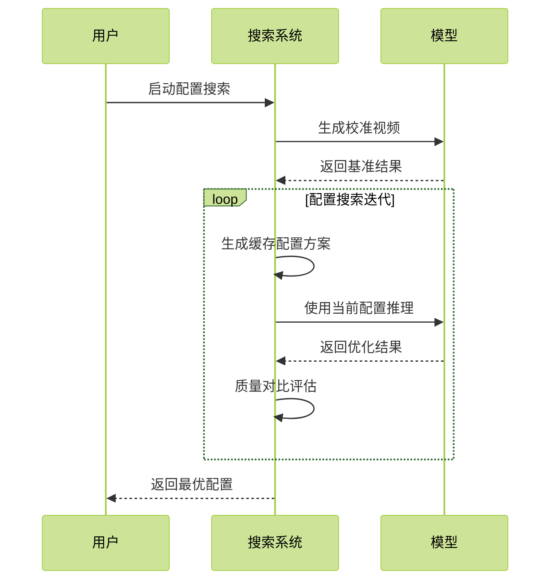
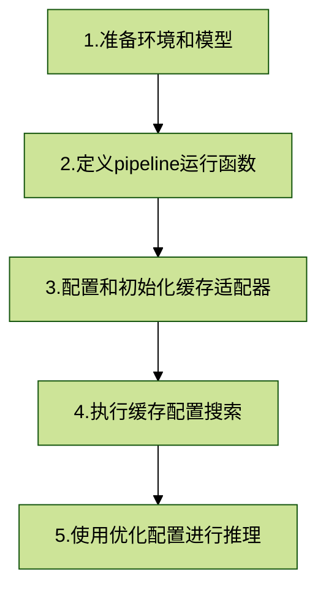

# 多模态视图生成推理优化工具

## 简介
本工具提供了针对大规模多模态生成模型的推理优化解决方案，专注于提升推理效率和资源利用率。

## 使用前准备

### 硬件平台
- 仅支持在以下产品中使用。
    - Atlas A2 训练系列产品/Atlas 800I A2 推理产品/A200I A2 Box 异构组件。

### 软件依赖
- 已参考[安装指南](../../../install_guide.md)完成开发环境配置。
- 参考开源模型仓库[OpenSoraPlanV1.2](https://github.com/PKU-YuanGroup/Open-Sora-Plan/releases/tag/v1.2.0) 的readme，下载模型权重，完成模型所需的python环境依赖的安装。

### 环境配置
```bash
# Install torch_npu and decord
pip install torch_npu==2.1.0.post6
# ref https://github.com/dmlc/decord
git clone --recursive https://github.com/dmlc/decord
cd decord
mkdir build && cd build 
cmake .. -DUSE_CUDA=0 -DCMAKE_BUILD_TYPE=Release -DFFMPEG_DIR=/usr/local/ffmpeg 
make 
cd ../python
PYTHONPATH=$PYTHONPATH:. python3 setup.py install --user

# Install other requirements
cd <Open-Sora-Plan-1.2.0>
pip install -e .[train]
```

## 功能介绍

### 支持模型

| 模型名称 | 框架 | 优化特性 | 说明 |
|---------|------|----------|------|
| OpenSoraPlanV1.2 | PyTorch | [采样优化](#自适应采样优化), [DiT缓存优化](#dit缓存优化) | • [模型源码链接](https://github.com/PKU-YuanGroup/Open-Sora-Plan/releases/tag/v1.2.0)<br>• 采样优化目前仅支持29\*480p场景,可达到2×加速,vbench精度损失<1% |


### DiT缓存优化

DiT缓存优化适配器，用于优化DiT（Diffusion Transformer）模型的推理性能，通过缓存中间计算结果来加速推理生成。

### 原理介绍

DiT模型在推理过程中需要多次计算transformer block的输出。传统的实现方式会在每个timestep重新计算所有block的输出，而缓存优化通过分析模型在不同timestep的行为，找到可以重复利用的中间计算结果。

主要优化思路：
1. **缓存区域选择**：通过搜索算法找到最适合缓存的transformer block区域。
2. **时间步优化**：确定缓存的有效时间范围，在关键时间步进行缓存更新。
3. **增量计算**：对于非关键时间步，使用缓存的增量计算结果。
4. **质量保证**：通过校准视频确保优化后的结果与原始质量一致。

优化流程：
1. 首先使用原始模型生成一组校准视频，作为质量基准。
2. 通过搜索算法探索不同的缓存配置。
3. 评估每个缓存配置生成的结果与校准视频的差异。
4. 选择能在减少计算量的同时保持生成质量的最优缓存配置。



### 使用流程概览



### 详细使用步骤
详细使用接口说明请参考 [DitCache接口文档](../../../python_api/multimodal_inference_apis/DitCache) 和 [DitCacheAdaptor](../../../python_api/multimodal_inference_apis/DitCache/DitCacheAdaptor.md)。

#### 1. 准备环境和模型

首先确保已完成环境配置和模型下载：
- 参考[环境要求](#环境要求)完成环境安装和模型权重下载

#### 2. 定义pipeline运行函数

需要定义一个闭包函数来运行pipeline并返回生成的视频。此函数将被缓存搜索过程调用，用于生成校准视频和评估不同缓存配置：

```python
def run_pipeline_and_save_videos(pipeline):
    """运行pipeline并返回生成的视频列表
    
    Args:
        pipeline: 模型pipeline实例
        
    Returns:
        List[np.ndarray]: 生成的视频列表，每个视频shape为(num_frames, h, w, c)
    """
    positive_prompt = """
    (masterpiece), (best quality), (ultra-detailed),
    {}
    """
    
    videos = pipeline(
        positive_prompt.format("a dog running on the beach"),
        num_frames=93,
        height=720,
        width=1280,
        num_inference_steps=100,
        guidance_scale=7.5
    ).images
    
    return videos
```

⚠️ **重要**: 在使用DitCache时，必须在pipeline前向的每个timestep开始时调用`DitCacheAdaptor.set_timestep_idx()`。这通常在模型的去噪循环中进行：

```python
# 在去噪循环中设置timestep
for step_id, t in enumerate(timesteps):
    DitCacheAdaptor.set_timestep_idx(step_id)  # 必须在每个timestep开始时调用
    model_output = pipeline(...)
```

#### 3. 配置和初始化缓存适配器

```python
from msmodelslim.pytorch.multi_modal.dit_cache import DitCacheSearchConfig, DitCacheAdaptor

# 设置缓存搜索配置
config = DitCacheSearchConfig(
    cache_ratio=1.3,  # 缓存加速比，推荐1.3
    num_sampling_steps=100  # 采样步数
)

# 创建缓存适配器
cache_adaptor = DitCacheAdaptor(pipeline, config)
```

#### 4. 执行缓存配置搜索

```python
# 执行搜索并获取最优配置
searched_config = cache_adaptor.search(
    run_pipeline_and_save_videos=run_pipeline_and_save_videos,
    prompts_num=1  # 生成视频的数量
)
```

完整的搜索脚本示例 [dit_cache_search_t2v_sp.sh](../../../../../example/osp1_2/dit_cache_search_t2v_sp.sh)：
```bash
#!/bin/bash
torchrun --nnodes=1 --nproc_per_node 8 --master_port 29503 \
    -m example.osp1_2.search_t2v_sp \
    --model_path /path/to/checkpoint-xxx/model_ema \
    --num_frames 93 \
    --height 720 \
    --width 1280 \
    --num_sampling_steps 100 \
    ...
    --text_prompt examples/prompt_list_0.txt \
    --search_type dit_cache \
    --cache_ratio 1.3 \
    --cache_save_path "./dit_cache_config.json"  # 保存搜索结果的路径
```

#### 5. 使用优化配置进行推理

##### 5.1 工作流程


##### 5.2 使用示例
```python
import json
from msmodelslim.pytorch.multi_modal.dit_cache import DitCacheAdaptor, DitCacheSearchConfig

# 1. 加载缓存配置
with open("./dit_cache_config.json", 'r') as f:
    cache_config = json.load(f)

# 2. 初始化缓存适配器并更新配置
adaptor = DitCacheAdaptor(
    pipeline=pipeline,
    config=DitCacheSearchConfig(num_sampling_steps=100)  # 与推理步数保持一致
)
adaptor.update_cache_config(**cache_config)

# 3. 执行推理
output = pipeline(
    prompt="a dog running on the beach",
    num_frames=93,
    height=720,
    width=1280,
    guidance_scale=7.5,
    num_inference_steps=100
)
```
在 pipeline 中显式调用 `DitCacheAdaptor.set_timestep_idx()`
```python
# 注意：在pipeline的前向传播代码中，需要在每个时间步开始时调用set_timestep_idx
# 示例：在pipeline的扩散循环中
for step_id, t in enumerate(timesteps):
    DitCacheAdaptor.set_timestep_idx(step_id)  # 在每个时间步开始时设置
    # ... 执行当前时间步的计算 ...

```

缓存配置文件示例 (dit_cache_config.json):
```json
{
    "cache_block_start": 8,    # 起始缓存block位置
    "cache_num_blocks": 4,     # 缓存block数量
    "cache_step_start": 20,    # 开始使用缓存的时间步
    "cache_step_interval": 2   # 缓存更新间隔
}
```
##### 5.3 完整推理脚本
完整的推理脚本示例 [dit_cache_sample_t2v_sp.sh](../../../../../example/osp1_2/dit_cache_sample_t2v_sp.sh)：
```bash
#!/bin/bash
torchrun --nnodes=1 --nproc_per_node 8 --master_port 29503 \
    -m example.osp1_2.sample_t2v_sp \
    --model_path /path/to/checkpoint-xxx/model_ema \
    --num_frames 93 \
    --height 720 \
    --width 1280 \
    --text_encoder_name google/mt5-xxl \
    --text_prompt examples/prompt_list_0.txt \
    --save_img_path "./sample_video_test" \
    --fps 24 \
    --guidance_scale 7.5 \
    --num_sampling_steps 100 \
    --sample_method EulerAncestralDiscrete \
    --model_type "dit" \
    --dit_cache_config "./dit_cache_config.json"  # 使用搜索得到的缓存配置
```

### 注意事项

1. **必须设置timestep**: 在每个timestep开始时调用`DitCacheAdaptor.set_timestep_idx(step_id)`
2. **搜索时间**: 缓存配置搜索过程包含校准视频生成和配置评估，可能需要较长时间
3. **配置复用**: 搜索得到的缓存配置可以保存为JSON文件，可以重复使用
4. **场景适配**: 不同的模型和场景可能需要不同的缓存配置，建议针对具体使用场景进行搜索优化
5. **参数一致性**: 确保在搜索和推理时使用相同的模型参数配置（如采样步数、图像尺寸等）
6. **加速效果**: 在29\*480p和93\*720p场景下，生成结果可达到约1.3倍加速，同时保持生成质量


## 自适应采样优化


采样优化适配器，用于搜索和优化稳定扩散模型的采样步骤，以提高推理效率。

### 原理介绍

稳定扩散模型在推理过程中需要多步采样来生成高质量的图像或视频。传统的均匀采样方法可能会在某些不重要的时间步上浪费计算资源，而在关键时间步上采样不足。采样优化的目标是找到一组更高效的采样步骤，在保持生成质量的同时减少计算开销。

主要优化思路：
1. **步骤对齐**：通过分析模型在不同时间步的行为，找到对生成质量影响最大的关键时间步。
2. **自适应采样**：在关键时间步进行更密集的采样，而在其他时间步可以适当减少采样频率。
3. **质量保证**：使用校准视频作为参考，确保优化后的采样步骤能够生成与原始质量相当的结果。

优化流程：
1. 首先使用原始模型生成一组校准视频，作为质量基准。
2. 通过搜索算法探索不同的采样步骤组合。
3. 评估每个采样方案生成的结果与校准视频的差异。
4. 选择能在减少计算量的同时保持生成质量的最优采样步骤。

### 使用步骤
详细使用接口说明请参考 [ReStepAdaptor.md](../../../python_api/multimodal_inference_apis/sampling_optimization_apis/ReStepAdaptor.md) 和 [ReStepSearchConfig.md](../../../python_api/multimodal_inference_apis/sampling_optimization_apis/ReStepSearchConfig.md)
#### 1. 运行原始模型推理，生成baseline视频搜索校准
```bash
cd <Open-Sora-Plan-1.2.0>
# Before run, please make sure the model is downloaded and the model path in the script is correct
bash scripts/text_condition/gpu/sample_t2v_sp.sh
```

#### 2. 搜索 timestep
获取到模型pipeline对象后，设置采样优化参数，传入生成的校准视频文件夹目录，调用`ReStepAdaptor`类进行 `timestep` 搜索，完整示例脚本： [search_t2v_sp.sh](../../../../../example/osp1_2/search_t2v_sp.sh)。
```python3
# Load pipeline, for example
pipeline: OpenSoraPipeline = load_t2v_checkpoint(model_path)

# Set restep search config
from msmodelslim.pytorch.multi_modal.sampling_optimization import ReStepSearchConfig, ReStepAdaptor
config = ReStepSearchConfig(
    # videos_path is the path to the directory containing the videos generated by original model with original steps
    videos_path='/path/of/your/calibration_videos',
    # save_dir is the path to the directory where the searched and optimized timestep will be saved
    save_dir='/path/to/save/searched_results',
    # set the number of sd infer steps
    num_sampling_steps=50,
)

# Create ReStepAdaptor
restep_adaptor = ReStepAdaptor(pipeline, config)

# Do the scheduler timestep search, will save the searched timestep to the ${save_dir}
scheduler_timestep = restep_adaptor.search()
```

#### 3. 用搜索的 timestep 进行推理


示例推理命令（完整脚本请参考[sample_t2v_sp.sh](../../../../../example/osp1_2/sample_t2v_sp.sh)）： 
```shell
torchrun --nnodes=1 --nproc_per_node 8  --master_port 29503 \
    -m msmodelslim.pytorch.multi_modal.examples.osp1_2.sample_t2v_sp \
    --model_path /path/to/checkpoint-xxx/model_ema \
    --num_frames 29 \
    --height 480 \
    --width 640 \
    --save_img_path "./sample_video_test" \
    ...
    --num_sampling_steps 50 \
    --sample_method EulerAncestralDiscrete \
    --schedule_timestep "/path/of/schedule/timestep/file.txt"
```
其中，`--schedule_timestep` 为搜索得到的 timestep 文件路径。
可参考[search_t2v_sp.sh](../../../../../example/osp1_2/search_t2v_sp.sh)修改模型参数路径和搜索得到的 timestep 文件路径，执行带采样优化的推理生成。