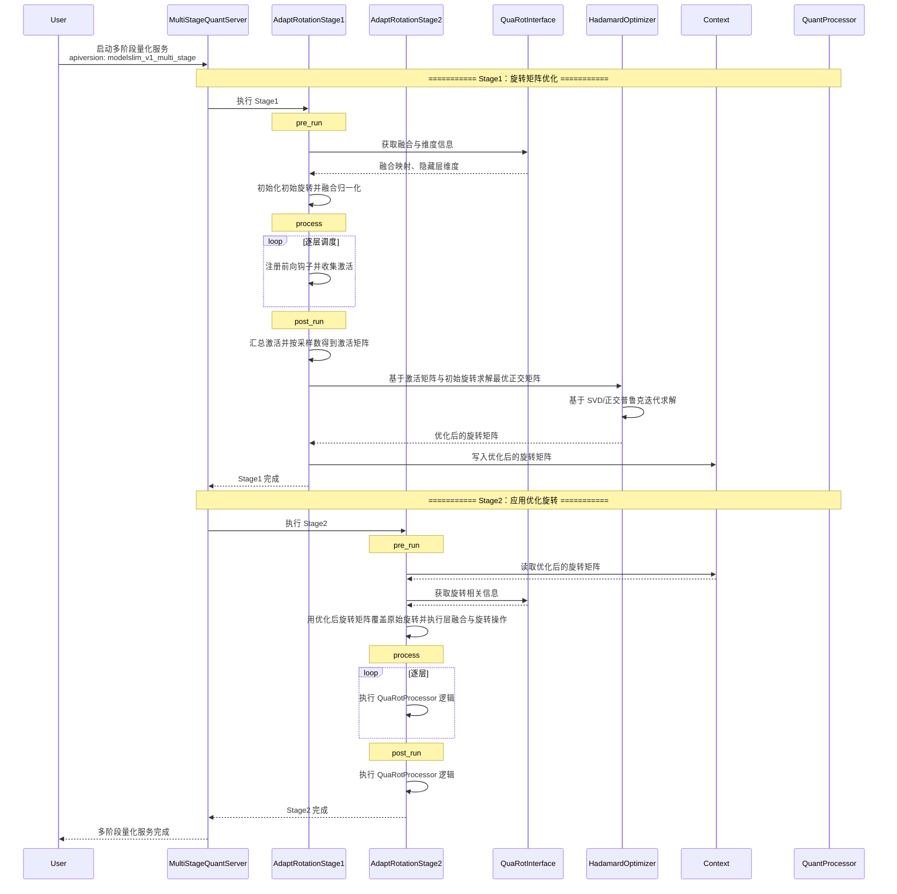

# Adapt Rotation：自适应旋转优化算法说明

## 简介

- **概述**：Adapt Rotation（自适应旋转优化）是一种用于大语言模型量化的离群值抑制算法，在 QuaRot 的基础上进一步优化旋转矩阵。该算法通过校准数据驱动的方式，迭代优化 Hadamard 旋转矩阵，使变换后的激活值在量化时具有更小的重构误差，从而有效抑制激活离群值，提升低比特量化精度。
- **核心思想**：在固定 Hadamard 矩阵的基础上，通过 Newton-Schulz 迭代求解正交极因子，学习了一个可优化的正交矩阵，使得在给定激活数据上，经过量化-反量化后的重构误差最小。
- **与 QuaRot 的关系**：使用 Adapt Rotation 的前提是模型适配 `AdaptRotationInterface`（它继承 `QuaRotInterface`，并额外提供 `get_hidden_dim()`）。Stage1 负责基于校准数据优化旋转矩阵；Stage2 将优化后的矩阵应用到 QuaRot 中，替代默认的 Hadamard 矩阵。



## 使用前准备

安装 msModelSlim 工具，详情请参见[《msModelSlim工具安装指南》](../../getting_started/install_guide.md)。

## 原理和实现

### 原理

1. **核心概念**：
   - 给定初始 Hadamard 矩阵 H 和校准激活数据，通过迭代优化学习正交旋转 R。
   - 变换后的旋转矩阵为 `H_adapted = H @ R`，满足正交性，保持计算等价。
   - 优化目标：最小化变换后激活值经 per-token 对称量化-反量化后的重构损失。

2. **迭代 Hadamard 优化**：
   - 使用 Newton-Schulz 迭代求解 `A.T @ B` 的正交极因子，得到正交矩阵 R_step。
   - 累积旋转：`R_acc = R_acc @ R_step`。
   - 每步对激活做旋转变换，对变换结果做 per-token 量化-反量化，计算归一化重构误差。

3. **两阶段流程**：
   - **Stage1**：收集指定层（如 `up_proj`）的激活，运行 Hadamard 优化，得到优化后的旋转矩阵，存入上下文机制中。
   - **Stage2**：从上下文机制读取优化后的旋转矩阵，覆盖 QuaRot 中对应维度的旋转矩阵，执行与 QuaRot 相同的层融合、插入旋转等流程。

### 实现

算法在 [msmodelslim/processor/adapt_rotation/](../../../../msmodelslim/processor/adapt_rotation) 中实现，核心类包括：

- `AdaptRotationProcessor`：顶层处理器，根据 `stage` 分发到 Stage1 或 Stage2。
- `AdaptRotationStage1Processor`：Stage1，收集激活并优化旋转矩阵。
- `AdaptRotationStage2Processor`：Stage2，继承 `QuaRotProcessor`，使用 Stage1 优化后的旋转矩阵覆盖原始旋转。
- `HadamardOptimizer`：用于迭代优化 Hadamard 旋转以获得正交极因子。

**1. Stage1 处理流程**

Stage1 在 prior 阶段运行，整体流程为：

- **准备与融合**：从适配器获取 LayerNorm 与 Linear 融合映射，创建初始 Hadamard 旋转矩阵，并执行 LayerNorm 与 Linear 的融合。
- **激活收集**：为匹配 `layer_type` 的 Linear 层注册前向钩子，在 Runner 调度前向传播时收集校准数据上的激活。
- **优化与传递**：汇总各层激活并按 `max_samples` 采样，运行 Hadamard 优化得到优化后的旋转矩阵，将结果写入 Context，供 Stage2 使用。

**2. Stage2 处理流程**

Stage2 在主阶段运行，与 QuaRot 共用同一套层融合、旋转流程：

- **读取与覆盖**：从 Context 读取 Stage1 得到的优化旋转矩阵，覆盖 QuaRot 中对应维度的旋转矩阵（替代默认 Hadamard）。
- **执行旋转**：按 QuaRot 的 preprocess / post_run 等流程，逐层执行层融合与旋转，完成模型旋转矩阵插入操作。

## 适用要求

- **模型架构要求**：模型必须支持 `AdaptRotationInterface`（继承 `QuaRotInterface`，并实现 `get_hidden_dim()`）。
- **多阶段配置**：算法配置时需注意 Stage1 通常在 prior 阶段运行，Stage2 通常在主阶段配合量化处理器执行。
- **Context 要求**：Stage1 必须在 ContextManager 下运行，以便将 `adapted_matrix` 传递给 Stage2。
- **量化配置要求**：`quant_dtype` 应与下游量化（如 linear_quant/autoround_quant）的激活值类型一致（w4a4 用 `int4`，w8a8 用 `int8`）。

## 功能介绍

### 使用说明

作为 Processor 使用，需配置 `type: "adapt_rotation"` 和 `stage: 1` 或 `stage: 2`，不同阶段的配置参数有所差异。Stage1 置于 `spec.prior` 的 process 列表中并配置该阶段的 dataset；Stage2 置于 `spec.process` 主流程列表中。

```yaml
spec:
  prior:
    - process:
        - type: "adapt_rotation"
          stage: 1
          steps: 20
          quant_dtype: "int4"
          layer_type: ["up_proj"]  # 根据模型需要进行选择，需考虑旋转影响的线性层
          block_size: -1
          max_samples: 2048
      dataset: mix_calib.jsonl  # 可以指定单独的数据集用于旋转矩阵优化，如果不指定则默认使用主阶段数据集

  process:
    - type: "adapt_rotation"
      stage: 2
      online: False
      block_size: -1
      down_proj_online_layers: []
      max_tp_size: 4
```

### YAML 配置示例

**多阶段示例（prior + 主阶段）**：

```yaml
apiversion: modelslim_v1

default_w4a4_dynamic: &default_w4a4_dynamic
  weight:
    scope: "per_group"
    dtype: "int4"
    symmetric: True
    method: "autoround"
    ext:
      group_size: 256
      scale_dtype: "bfloat16"
  act:
    scope: "per_token"
    dtype: "int4"
    symmetric: True
    method: "minmax"

spec:
  prior:
    - process:
        - type: "adapt_rotation"
          stage: 1
          layer_type: ["up_proj"] # 根据模型需要进行选择，需考虑旋转影响的线性层
          steps: 20
          quant_dtype: "int4"
          block_size: -1
          max_samples: 2048
      dataset: boolq.jsonl

  process:
    - type: "adapt_rotation"
      stage: 2
      online: False
      block_size: -1
      max_tp_size: 1

    - type: "autoround_quant"
      iters: 400
      enable_round_tuning: true
      strategies:
        - qconfig: *default_w4a4_dynamic
          include:
            - "*.up_proj"
            - "*.gate_proj"

  save:
    - type: "ascendv1_saver"
      part_file_size: 4

  dataset: mix_calib.jsonl
```

### YAML 配置字段详解

#### Stage1 字段

| 字段名 | 作用 | 类型 | 说明 | 默认值 |
|--------|------|------|------|--------|
| type | 处理器类型标识 | `string` | 固定为 `"adapt_rotation"` | - |
| stage | 阶段标识 | `int` | 固定为 `1` | - |
| steps | 迭代优化步数 | `int` | Hadamard 优化最大迭代次数 | `20` |
| quant_dtype | 量化激活类型 | `string` | `"int4"` 或 `"int8"`，应与下游量化中的 act.dtype 一致 | `"int4"` |
| layer_type | 收集激活的层名子串 | `array[string]` | 用于匹配 Linear 层名称，如 `["up_proj"]` | `["up_proj"]` |
| block_size | 块大小 | `int` | 旋转矩阵块大小，取值为大于 0 的 2 的幂，当设置为-1时表示 hidden_dim（不分块） | `-1` |
| max_samples | 每层最大采样数 | `int` | 控制激活采样数量 | `2048` |

#### Stage2 字段

| 字段名 | 作用 | 类型 | 说明 | 默认值 |
|--------|------|------|------|--------|
| type | 处理器类型标识 | `string` | 固定为 `"adapt_rotation"` | - |
| stage | 阶段标识 | `int` | 固定为 `2` | - |
| online | 是否启用“在线旋转” | `bool` | 当为 `True` 时，在量化过程动态注入旋转计算 | `False` |
| block_size | 块大小 | `int` | 旋转矩阵块大小，取值为大于 0 的 2 的幂，当设置为-1时表示 hidden_dim（不分块） | `-1` |
| down_proj_online_layers | 应用在线旋转的 down 层索引 | `array[int]` | 仅当 `online=True` 时生效 | `[]` |
| max_tp_size | 最大张量并行度（在线旋转分块规模） | `int` | 仅当 `online=True` 时生效，用于在线旋转矩阵构造与并行相关的分块参数，需为 `1` 或正的 2 的幂 | `4` |

## 模型适配

Adapt Rotation 的模型适配要求：

- **AdaptRotationInterface**：必须实现（继承 `QuaRotInterface`，并实现 `get_hidden_dim()`）。Stage1 会生成并优化 `hidden_dim` 维度的旋转矩阵，把结果写入 `ctx["adapt_rotation"].state["adapted_matrix"]`；Stage2 复用 QuaRot 的融合/旋转流程，并用该矩阵覆盖对应维度的默认旋转。
- **LAOSOnlineRotationInterface**：仅在 Stage2 配置 `online: True` 时需要实现。

其中与 `QuaRotInterface` 相关的通用适配步骤，可参考 [QuaRot 模型适配](quarot.md#模型适配)。

## FAQ

### Stage1 未收集到激活

**现象**：`act_dict is empty`，AdaptRotation stage1 未收集到任何激活。

**解决方案**：检查 `layer_type` 是否与模型中的 Linear 层名称匹配，例如 `up_proj`、`gate_proj` 等。

### Context 为空

**现象**：Stage2 无法获取 `adapted_matrix`，日志提示 `context is None` 或 `no adapted_matrix in context`。

**解决方案**：确保 Stage1 在 prior 阶段运行，且配置了 `ContextManager`。Stage1 与 Stage2 必须在同一量化流程中按顺序执行。

### quant_dtype 与下游量化不一致

**现象**：旋转优化使用的量化类型与下游量化阶段不同，导致精度下降。

**解决方案**：将 Stage1 的 `quant_dtype` 设置为与下游 `qconfig.act.dtype` 一致，如 w4a4 用 `int4`，w8a8 用 `int8`。

### MoE模型执行该算法速度很慢

**现象**：当模型为 MoE 结构时，运行该处理器后速度明显变慢，Stage1 的激活收集与 Hadamard 优化耗时显著增加。

**解决方案**：MoE 的专家通常包含大量“非共享”的线性层参数；如果 `layer_type` 的匹配范围落到了专家非共享部分，就会导致需要收集激活并进行旋转优化的线性层数量急剧上升，从而显著拉长优化时间。检查并调整 `layer_type`，尽量只选择共享层而不是专家非共享线性层。
