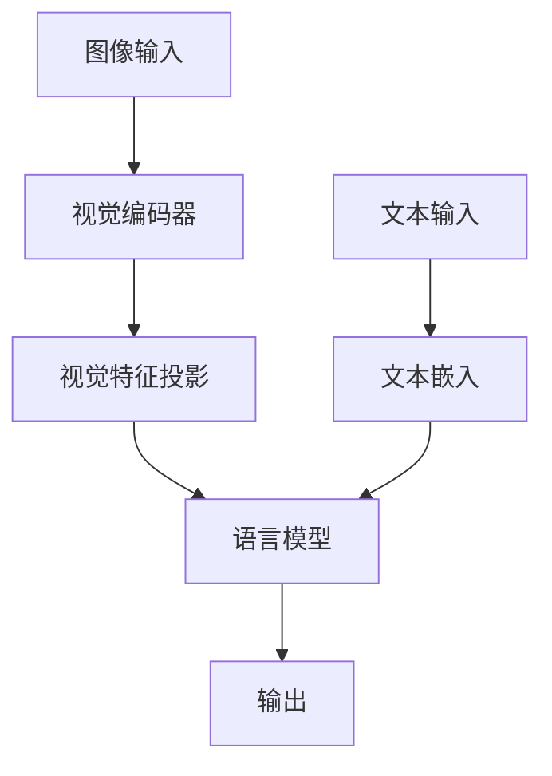

# 多模态理解模型接入指南

本文档面向需要将自有多模态理解模型（Vision-Language Model, VLM）接入 msModelSlim 的开发者。

多模态理解模型通常由视觉编码器、视觉特征投影层和语言模型组成，能够同时处理图像和文本输入。相比纯语言模型，多模态理解模型的量化接入需要额外考虑：
- **多模态校准数据的准备**：支持图像和文本prompt结合等模态融合的校准数据类型
- **视觉特征与语言特征的融合**：如Merger、DeepStack等特殊架构的适配
- **视觉部分完整处理**：视觉部分一次性加载并处理，简化多模态融合逻辑
- **语言模型逐层加载**：语言模型逐层加载和量化，避免对内存和显存的占用过大

## 前置知识

在开始之前，建议先阅读[《模型接入指南》](./模型接入.md)，了解基础的接口概念和模型适配器设计。

## 概念说明

### 多模态模型架构

典型的多模态理解模型包含以下组件：



- **视觉编码器**：将图像转换为视觉特征（如ViT、CLIP等）
- **视觉特征投影**：将视觉特征映射到语言模型的隐藏空间（如PatchMerger等）
- **语言模型**：处理融合后的多模态特征（如Qwen、GLM系列等）

### 多模态模型适配器

多模态模型适配器继承自 `VlmBaseModelAdapter`，提供了一些通用的多模态处理能力：
- `_load_config`：模型config加载
- `_collect_inputs_to_device`：批量收集预处理过的多模态数据并移动输入到目标设备

同时需要实现 `ModelSlimPipelineInterfaceV1` 接口，与纯语言模型的主要区别在于：
- **`init_model`**：需要完整加载视觉部分，仅加载语言部分首层
- **`generate_model_visit`**：先处理整个视觉部分，再逐层处理语言部分
- **`generate_model_forward`**：需要实现视觉部分完整前向、特征融合、语言部分逐层前向的流程
- **`handle_dataset`**：需要处理多模态校准数据，将图像路径和文本转换为模型输入

## 多模态模型接入

以下内容将以 [Qwen3-VL-MoE](../../msmodelslim/model/qwen3_vl_moe/model_adapter.py) W8A8混合量化场景（简称"场景示例"）的模型接入为例。

**Qwen3-VL-MoE的加载策略**：
- **视觉部分**：完整加载（包含所有blocks、mergers等），作为一个整体进行处理和量化
- **语言部分**：逐层加载和处理，节省内存

**注**：不同模型可根据实际情况选择不同策略。例如，如果视觉部分需要更细粒度的控制，也可以采用逐层方案。

### 1. 新建模型适配器目录和文件

建议在 [`msmodelslim/model/`](../../msmodelslim/model/) 下创建独立目录，如 `qwen3_vl_moe/`，包含以下文件：
- `model_adapter.py`：模型适配器主文件
- `__init__.py`：导出适配器类
- `moe_utils.py`（可选）：MoE融合权重等特殊结构的辅助转换工具

### 2. 定义适配器类并继承必要接口

```python
from msmodelslim.model.vlm_base import VlmBaseModelAdapter
from msmodelslim.model.interface_hub import ModelSlimPipelineInterfaceV1
from msmodelslim.utils.logging import logger_setter

@logger_setter()
class Qwen3VLMoeModelAdapter(VlmBaseModelAdapter,  # 提供多模态通用能力
                              ModelSlimPipelineInterfaceV1):  # 必要，服务于量化调度
    """
    Qwen3-VL-MoE multimodal model adapter.
    Key features:
    - Layer-wise loading for text decoder
    - Vision encoder processed as a whole
    - Automatic MoE fusion layer conversion via MoeConverterProcessor
    - Multimodal calibration dataset support
    """
    pass
```

### 3. 实现接口方法

#### 3.1 `handle_dataset`：处理多模态校准数据

将校准数据（`VlmCalibSample`）转换为多模态理解模型支持的输入，`VlmCalibSample`的定义可参考[`vlm_dataset_loader.py`](../../msmodelslim/infra/vlm_dataset_loader.py)：

**关键点**：
- 使用 `VlmCalibSample` 结构体统一数据格式，校准数据支持的格式参考：[校准数据准备](#校准数据准备)
- **加载processor或tokenizer**：主流多模态理解模型（如Qwen3-VL）一般使用processor对数据做预处理，但以InternVL2-8B为例的模型则使用tokenizer对数据做预处理，需要根据模型官方给出的推理示例进行设置
- **构建messages**：使用processor对数据做预处理的多模态理解模型，一般有自己特定的messages形式，需要参考模型官方给出的推理示例实现定义
- 使用 `_collect_inputs_to_device` 批量移动tensor到目标设备

```python
def handle_dataset(self, dataset: Any, device: DeviceType = DeviceType.NPU) -> List[Any]:
    """
    Convert calibration samples to model inputs.
    Args:
        dataset: List of VlmCalibSample:
            - VlmCalibSample(image="/path/to/img.jpg", text="Describe.")  # 图文
    Returns:
        List of model inputs (dict with input_ids, pixel_values, etc.)
    """
    from msmodelslim.infra.vlm_dataset_loader import VlmCalibSample
    from transformers import AutoProcessor
    self._processor = AutoProcessor.from_pretrained(self.model_path, trust_remote_code=True, local_files_only=True)
    
    model_inputs = []
    for sample in dataset:
        image_path = sample.image
        text = sample.text
        # 构建messages
        messages = [
            {
                "role": "user",
                "content": [
                    {"type": "image", "image": image_path},
                    {"type": "text", "text": text}
                ]
            }
        ]
        # 使用processor转换
        inputs = self._processor.apply_chat_template(
            messages,
            tokenize=True,
            add_generation_prompt=True,
            return_dict=True,
            return_tensors="pt"
        )
        
        # 移动tensor到目标设备
        # 此处的keys和defaults需要参考原始的模型定义文件
        # 以Qwen3-VL-235B-A22B为例，需要查看transformers.models.qwen3_vl_moe.modeling_qwen3_vl_moe.py
        # 确定Qwen3VLMoeForConditionalGeneration类对应的forward参数
        inputs = self._collect_inputs_to_device(
            inputs,
            device,
            keys=[
                'input_ids',
                'attention_mask',
                'position_ids',
                'past_key_values',
                'inputs_embeds',
                'labels',
                'pixel_values',
                'pixel_values_videos',
                'image_grid_thw',
                'video_grid_thw',
                'cache_position',
                'logits_to_keep',
            ],
            defaults={'logits_to_keep': 0}
        )
        
        model_inputs.append(inputs)
    
    return model_inputs
```

#### 3.2 `init_model`：初始化模型（视觉部分完整加载+语言部分首层加载）

多模态理解模型的初始化需要注意：
- **视觉部分完整加载**：一次性加载整个视觉部分
- **语言部分仅加载首层**：仅加载第一个文本解码层，其余层按需动态加载
- **设置推理模式**：设置`_attn_implementation='eager'`等

**关键点**：
- 通过临时设置 `num_hidden_layers=1` 来控制仅加载一个语言部分解码层
- 视觉部分会被完整加载（所有blocks、patch_embed、merger、deepstack_merger_list等）
- 使用 `from_pretrained` 而非手动加载权重，更简洁可靠
- 如果首层是MoE层，需要进行3D权重转换（参考 `moe_utils.py`）

```python
def init_model(self, device: DeviceType = DeviceType.NPU) -> nn.Module:
    """
    Initialize model with vision encoder fully loaded and only first text layer.
    Returns:
        nn.Module: Model with:
            - model.visual (完整加载：所有blocks、mergers等)
            - language_model.layers[0] (loaded)
            - language_model.layers[1..N] (待动态加载)
    """
    # 1. 加载config
    from transformers import Qwen3VLMoeForConditionalGeneration
    
    # 2. 不使用Cache以节省显存
    self.config.use_cache = False
    
    # 3. 保存原始语言部分层数，临时设置为1用于只加载首层
    origin_layers = self.config.text_config.num_hidden_layers
    self.config.text_config.num_hidden_layers = 1
    
    # 4. 使用from_pretrained加载模型
    # 视觉部分会完整加载，语言部分只加载1层
    model = Qwen3VLMoeForConditionalGeneration.from_pretrained(
        self.model_path,
        config=self.config,
        trust_remote_code=self.trust_remote_code,
        torch_dtype="auto",
        local_files_only=True,
        device_map="cpu",
        attn_implementation='eager'
    ).eval()
    
    # 5. 恢复原始层数配置和attention模式
    self.config.text_config.num_hidden_layers = origin_layers
    self.config.text_config._attn_implementation = 'eager'
    
    # 6.加载完整state_dict
    state_dict = self._get_state_dict(model)
    model.load_state_dict(state_dict)

    # 7. 如果语言部分首层是MoE层，执行权重转换
    if self._is_moe_layer(0):
        self._convert_single_moe_layer(model.model.language_model.layers[0], 0)
    
    return model
```

#### 3.3 `generate_model_visit`：生成模型访问序列

按照模型结构的拓扑顺序，依次yield各个需要量化的模块。**顺序非常重要**，必须与前向传播顺序一致。

**关键点**：
- **视觉部分作为整体**：`model.visual` 一次性yield，包含所有子模块
- **语言部分逐层yield**：使用 `generated_decoder_layer_visit_func` 标准函数
- 使用 `generate_decoder_layer` 生成器动态加载文本层
- 对于MoE层，在 `_load_decoder_if_not_exist` 中自动进行权重转换

```python
def generate_model_visit(self, model: nn.Module) -> Generator[ProcessRequest, Any, None]:
    """
    Generate model visit sequence for layer-wise processing.
    
    Order (critical):
    1. model.visual (整个视觉部分作为一个整体)
    2. language_model.layers[0], language_model.layers[1], ..., language_model.layers[L-1]
    """
    # 1. 处理整个视觉部分（作为一个整体）
    yield ProcessRequest(
        name="model.visual",
        module=model.model.visual,
        args=(),
        kwargs={}
    )
    
    # 2. 逐层处理语言部分
    yield from generated_decoder_layer_visit_func(
        model, 
        transformer_blocks=self.generate_decoder_layer(model)
    )

def generate_decoder_layer(self, model: nn.Module) -> Generator[Tuple[str, nn.Module], None, None]:
    """
    Generate decoder layers, loading them on-demand.
    
    Yields:
        (layer_name, layer_module) tuples
    """
    num_layers = self.config.text_config.num_hidden_layers
    
    for layer_idx in range(num_layers):
        name = f"model.language_model.layers.{layer_idx}"
        
        # 动态加载layer（如果尚未加载）
        layer = self._load_decoder_if_not_exist(model, name, layer_idx)
        
        yield name, layer
```

#### 3.4 辅助方法：动态加载语言部分的权重

由于视觉部分已在 `init_model` 中完整加载，只需实现语言部分文本解码器的动态加载逻辑。

```python
def _load_decoder_if_not_exist(self, model: nn.Module, name: str, layer_idx: int) -> nn.Module:
    """
    Dynamically load a text decoder layer if not already loaded.
    Args:
        model: The model instance
        name: Full layer name (e.g., "model.language_model.layers.1")
        layer_idx: Layer index
    Returns:
        Loaded decoder layer module
    """
    try:
        # 尝试访问该层
        decoder = model.get_submodule(name)
        # 检查是否真正加载（不在meta device上）
        try:
            _ = decoder.input_layernorm.weight.device
            return decoder
        except RuntimeError:
            pass  # 在meta device上，需要加载
    except AttributeError:
        pass  # 层不存在，需要创建并加载
    
    # 禁用reset_parameters避免不必要的初始化
    from unittest.mock import patch
    with patch.object(nn.Linear, 'reset_parameters', lambda _self: None):
        # 创建层结构
        from transformers.models.qwen3_vl_moe.modeling_qwen3_vl_moe import Qwen3VLMoeTextDecoderLayer
        decoder = Qwen3VLMoeTextDecoderLayer(
            self.config.text_config,
            layer_idx=layer_idx
        )
        
        # 从safetensors加载权重
        state_dict = self._get_state_dict(decoder, prefix=name)
        decoder.load_state_dict(state_dict)
        decoder.eval()
        
        # 添加到模型的layer列表
        module_list = model.model.language_model.layers
        if len(module_list) <= layer_idx:
            module_list.append(decoder)
        else:
            module_list[layer_idx] = decoder
    
    # （仅MoE结构存在3D融合权重的模型需要）如果是MoE层，执行权重转换
    if self._is_moe_layer(layer_idx):
        self._convert_single_moe_layer(decoder, layer_idx)
    
    return decoder

def _is_moe_layer(self, layer_idx: int) -> bool:
    """Check if a layer is a MoE layer"""
    # 3D融合权重的MoE层判断
    pass

def _convert_single_moe_layer(self, layer: nn.Module, layer_idx: int):
    """
    Convert MoE layer's 3D fused weights to standard nn.Linear layers.
    
    Args:
        layer: The decoder layer module
        layer_idx: Layer index (for logging)
    """
    # 需要单独在moe_utils.py中实现标准nn.Linear层的等价替换对应的底层逻辑
    # 以Qwen3-VL-235B-A22B为例，需要查看transformers.models.qwen3_vl_moe.modeling_qwen3_vl_moe.py
    # 确定MoE层Qwen3VLMoeTextSparseMoeBlock的定义并进行等价替换设计
    from .moe_utils import UnstackedQwen3VLMoeSparseMoeBlock
    """
    等价替换操作
    """
    pass
```

#### 3.5 `generate_model_forward`：生成模型前向传播序列

实现模型的完整前向传播，同时yield每一层的处理请求。视觉部分一次性运行，语言部分逐层运行。

**关键点**：
- **前向逻辑梳理**：相比大语言模型，多模态理解模型涉及模态融合等操作，其逐层前向传播序列处理更为复杂。所以必须对原始模型文件中的前向传播定义进行充分了解，以Qwen3-VL-235B-A22B为例，需要查看transformers.models.qwen3_vl_moe.modeling_qwen3_vl_moe.py获取原模型定义
- **视觉编码器一次性运行**：调用 `model.model.visual()` 获取所有输出
- **视觉特征融合**：使用 `masked_scatter` 将图像特征替换到文本序列中，每个模型的具体操作需要参考原模型定义
- **DeepStack注入**：在特定文本层后注入对应的deepstack视觉特征，每个模型是否涉及需要参考原模型定义
- **逐层yield文本解码器层**：通过 `generate_decoder_layer` 动态加载并处理每一层
- **device管理**：通过 `LoadProcessor` 自动管理，无需手动 `.to(device)`

```python
def generate_model_forward(self, model: nn.Module, inputs: Any) -> Generator[ProcessRequest, Any, None]:
    """
    Generate model forward sequence.
    
    Flow:
    1. Run vision encoder as a whole -> get image features
    2. Merge image features into text embeddings
    3. Run each text decoder layer with proper inputs
    """
    # 1. 提取校准样本
    if isinstance(inputs, list):
        sample = inputs[0]
    else:
        sample = inputs
    
    # ========== 阶段1: 视觉编码器完整前向传播 ==========
    # 根据inputs中不为None的字段，明确视觉部分的输入参数
    # 具体的实现逻辑，请参考原模型定义
    pixel_values = sample['pixel_values']
    image_grid_thw = sample['image_grid_thw']
    
    with torch.no_grad():
        # 一次性运行整个视觉部分
        image_embeds, deepstack_image_embeds = model.model.visual(
            pixel_values, grid_thw=image_grid_thw
        )
    
    # Yield视觉部分的处理结果
    yield ProcessRequest(
        name="model.visual",
        module=model.model.visual,
        args=(pixel_values, image_grid_thw),
        kwargs={}
    )
    
    # ========== 阶段2: 构建语言模型输入（融合视觉特征） ==========
    # 根据inputs中不为None的字段，明确语言部分的输入参数
    # 具体的实现逻辑，请参考原模型定义
    input_ids = sample['input_ids']
    attention_mask = sample['attention_mask']
    
    # 获取文本嵌入
    inputs_embeds = model.model.language_model.embed_tokens(input_ids)
    
    # 融合视觉特征：用image_embeds替换<image>占位符位置
    """
    融合视觉特征的实现
    """
    
    # ========== 阶段3: 文本解码器逐层前向传播 ==========
    # 具体的实现逻辑，请参考原模型定义
    """
    position_ids和attention_mask的实现
    position_ids = ...
    attention_mask = ...
    text_position_ids = ...
    cache_position = ...
    position_embeddings = ...
    """

    # 逐层处理文本解码器
    hidden_states = inputs_embeds
    for layer_idx, (name, layer) in enumerate(self.generate_decoder_layer(model)):
        with torch.no_grad():
            # 前向传播
            hidden_states = layer(
                hidden_states,
                attention_mask=attention_mask,
                position_ids=text_position_ids,
                cache_position=cache_position,
                position_embeddings=position_embeddings,
                past_key_values=None,
                use_cache=False,
            )
            
            # DeepStack注入（如果该层需要）
            """
            DeepStack注入的实现
            """
        
        # Yield当前层处理结果
        yield ProcessRequest(
            name=name,
            module=layer,
            args=(hidden_states,),
            kwargs={
                'attention_mask': attention_mask,
                'position_ids': text_position_ids,
                'cache_position': cache_position,
                'position_embeddings': position_embeddings,
                'past_key_values': None,
                'use_cache': False,
            }
        )
```

### 4. 注册模型名

在 [`config/config.ini`](../../config/config.ini) 中注册模型：

```ini
[ModelAdapter]
# ...其他模型...
qwen3_vl_moe = Qwen3-VL-30B-A3B, Qwen3-VL-235B-A22B

[ModelAdapterEntryPoints]
# ...其他模型...
qwen3_vl_moe = msmodelslim.model.qwen3_vl_moe.model_adapter:Qwen3VLMoeModelAdapter
```

### 5. 准备量化配置

创建量化配置文件（YAML），例如 `qwen3_vl_moe_w8a8.yaml`：

```yaml
apiversion: multimodal_vlm_modelslim_v1
# ========== W8A8动态量化配置 ==========
default_w8a8_dynamic: &default_w8a8_dynamic
  act:
    scope: "per_token"
    dtype: "int8"
    symmetric: True
    method: "minmax"
  weight:
    scope: "per_channel"
    dtype: "int8"
    symmetric: True
    method: "minmax"
# ========== W8A8静态量化配置 ==========
default_w8a8: &default_w8a8
  act:
    scope: "per_tensor"
    dtype: "int8"
    symmetric: False
    method: "minmax"
  weight:
    scope: "per_channel"
    dtype: "int8"
    symmetric: True
    method: "minmax"

spec:
  # ========== 量化配置 ==========
  process:
    - type: "linear_quant"
      qconfig: *default_w8a8
      include:
        - "*"
      exclude:
        - "*experts*"  # Exclude MoE experts for dynamic quantization
        - "*linear_fc2"
        - "*merger*"
        - "*deepstack_merger_list*"
        - "*mlp.gate"
    - type: "linear_quant"
      qconfig: *default_w8a8_dynamic
      include:
        - "*experts*"  # MoE experts use dynamic quantization
      exclude:
        - "*linear_fc2"
        - "*merger*"
        - "*deepstack_merger_list*"
        - "*mlp.gate"
  
  # ========== 保存配置 ==========
  save:
    - type: "ascendv1_saver"
      part_file_size: 4
  # ========== 数据集配置 ==========
  dataset: calibImages  # 校准图片目录
  default_text: "Describe this image in detail."  # 图片默认的文本prompt
```

## 校准数据准备

### 类型1：纯图像（默认文本prompt）

用户可通过在yaml配置文件的dataset字段传入图像目录，以及设置default_text字段作为所有图像统一的默认文本prompt。

**格式**：图片目录，无 `.json`/`.jsonl` 文件

```
calibImages/
├── img1.jpg
├── img2.png
└── img3.jpeg
```

**配置**：
```yaml
dataset: calibImages
default_text: "Describe this image in detail."
```

### 类型2：纯图像（自定义文本prompt）

用户可通过在yaml配置文件的dataset字段传入图像目录，并通过符合要求的单个 `.json`/`.jsonl` 文件设置每个图像独立的文本prompt。

**格式**：图片目录 + 单个 `.json`/`.jsonl` 文件

**图片目录 + 单个 `.jsonl` 文件**
```
calibImages/
├── img1.jpg
├── img2.png
├── img3.jpeg
└── calib_data.jsonl
```

**calib_data.jsonl**：
```json
{"image": "img1.jpg", "text": "What objects are in this image?"}
{"image": "img2.png", "text": "Describe the scene."}
{"image": "img3.jpeg", "text": "What is the main subject?"}
```

**图片目录 + 单个 `.json` 文件**
```
calibImages/
├── img1.jpg
├── img2.png
├── img3.jpeg
└── calib_data.json
```

**calib_data.json**：
```json
[
{"image": "img1.jpg", "text": "What objects are in this image?"},
{"image": "img2.png", "text": "Describe the scene."},
{"image": "img3.jpeg", "text": "What is the main subject?"}
]
```

**配置**：
```yaml
dataset: calibImages
```

## 量化自有模型

完成模型适配器编写、注册、配置文件和校准数据准备后，即可执行量化：

```bash
msmodelslim quant --model_path ${MODEL_PATH} \
                  --save_path ${SAVE_PATH} \
                  --device npu \
                  --model_type ${MODEL_TYPE} \
                  --config_path ${CONFIG_PATH} \
                  --trust_remote_code True
```

**参数说明**：
请注意`trust_remote_code`为`True`时可能执行浮点模型权重中代码文件，请确保浮点模型来源安全可靠。其中\${MODEL_PATH}为原始浮点权重路径，\${SAVE_PATH}为用户自定义的量化权重保存路径，\${MODEL_TYPE}为注册的模型名称，\${CONFIG_PATH}为YAML配置文件路径。

## 常见问题与注意事项

### 1. 量化过程报错 Out Of Memory (OOM) 问题

**症状**：量化时显存溢出

**原因和解决方案**：
- 对于**视觉部分**：当前Qwen3-VL-MoE采用完整加载方案，如遇OOM，可考虑：
  - 减少校准数据中的图片数量
  - 使用较小分辨率的图片进行校准
  - 使用显存更大的NPU
  - 参考语言部分逐层量化的实现自行适配视觉部分的逐层处理
- 对于**文本部分**：确保正确实现了逐层处理
- 确保 `init_model` 中 `num_hidden_layers` 临时设为1，只加载首个文本解码器层
- 在 `generate_decoder_layer` 中使用 `_load_decoder_if_not_exist` 按需加载文本解码器层

### 2. MoE权重转换问题

**症状**：MoE层3D权重无法直接加载为标准Linear层

**原因**：原始模型使用3D参数存储所有专家权重

**解决**：
- 参考[辅助方法动态加载语言部分的权重](#34-辅助方法动态加载语言部分的权重)中 `_convert_single_moe_layer` 方法，实现3D权重切分为多个Linear层
- 参考 [`moe_utils.py`](../../msmodelslim/model/qwen3_vl_moe/moe_utils.py) 的等价替换底层逻辑实现

### 3. 校准数据格式错误

**症状**：运行中报错`InvalidDatasetError`

**原因**：校准数据格式不符合要求或模型不支持该类型

**解决**：
- 检查数据格式是否符合: [校准数据准备](#校准数据准备)
- 确保图片路径可访问、格式正确（.jpg/.png/.jpeg）

## 高级特性

### 支持IterSmooth离群值抑制算法

如果需要支持IterSmooth算法（用于抑制激活值离群值），需要实现 `IterSmoothInterface`：

```python
from msmodelslim.model.interface_hub import IterSmoothInterface

class Qwen3VLMoeModelAdapter(VlmBaseModelAdapter,
                              ModelSlimPipelineInterfaceV1,
                              IterSmoothInterface):
    
    def get_adapter_config_for_subgraph(self,) -> List[AdapterConfig]:
        """
        Get adapter config for subgraph-based anti-outlier processing (iter_smooth).
        
        Defines the subgraph structure for norm-linear, ov, and other fusions.
        """
        adapter_config = []
        
        # 针对语言部分的文本解码器添加离群值抑制映射配置
        for layer_idx in range(self.config.text_config.num_hidden_layers):
            # Norm-Linear: input_layernorm -> QKV
            """
            定义norm_linear_mapping_config
            """
            # OV fusion: V -> O
            """
            定义ov_mapping_config
            """
            # 定义其他类型映射配置
            """
            定义linear_linear_mapping_config
            定义up_down_mapping_config
            """

            # 添加到适配器配置
            adapter_config.extend([
                AdapterConfig(
                    subgraph_type="norm-linear",
                    mapping=norm_linear_mapping_config
                ),
                AdapterConfig(
                    subgraph_type="ov",
                    mapping=ov_mapping_config,
                    extra_config={}
                ),
            ])
        return adapter_config
```

详见：[Iterative Smooth 适配](../算法说明/Iterative_Smooth.md#模型适配)

### 支持QuaRot旋转离群值抑制算法

如果需要支持QuaRot算法（基于旋转变换显著平滑数据的分布），需要实现旋转矩阵的初始化和应用：

```python
from msmodelslim.model.interface_hub import QuaRotInterface

class Qwen3VLMoeModelAdapter(VlmBaseModelAdapter,
                              ModelSlimPipelineInterfaceV1,
                              QuaRotInterface):
    
    def get_ln_fuse_map(self) -> Tuple[Dict[str, List[str]], Dict[str, List[str]]]:
        """
        获取LayerNorm与Linear层的融合映射
        """
        # 实现细节参考QuaRot文档
        pass

    def get_bake_names(self) -> Tuple[List[str], List[str]]:
        """
        获取需要mean融合的Linear层名称列表
        """
        # 实现细节参考QuaRot文档
        pass

    def get_rotate_map(self, block_size: int) -> Tuple[List[RotatePair], List[RotatePair]]:
        """
        获取旋转映射，包括左旋转和右旋转的配置
        """
        # 实现细节参考QuaRot文档
        pass
```

详见：[QuaRot 适配](../算法说明/QuaRot.md#模型适配)

## 参考资料
- [模型接入指南](./模型接入.md)：大模型基础接入指导
- [Qwen3-VL-MoE模型适配器](../../msmodelslim/model/qwen3_vl_moe/model_adapter.py)：完整实现示例
- [VLM数据集加载器](../../msmodelslim/infra/vlm_dataset_loader.py)：校准数据加载处理
- [多模态VLM量化服务](../../msmodelslim/app/quant_service/multimodal_vlm_v1/)：服务层实现
- [一键量化使用说明](../功能指南/一键量化/使用说明.md)：命令行参数详解