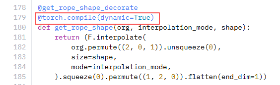
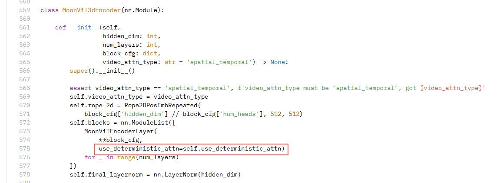

# Kimi K2.5 量化案例

## 模型介绍

Kimi-K2.5 是月之暗面（Moonshot AI）研发的原生多模态模型。基于 Kimi-K2-Base，通过 15 万亿个混合视觉和文本令牌持续预训练构建，可无缝整合视觉与语言理解、先进代理能力及多种交互范式。其核心特征包括：原生多模态能力（擅长视觉知识、跨模态推理及视觉输入下的代理工具使用）、视觉编码能力（可从视觉规范生成代码并协调视觉数据处理工具）以及代理群功能（能将复杂任务分解为并行子任务，由领域特定代理协同执行）。

## 使用前准备

- 安装 msModelSlim 工具，详情请参见[《msModelSlim工具安装指南》](../../../docs/zh/getting_started/install_guide.md)。
- 对于Kimi K2.5系列模型，由于模型参数量较大，请先完成“运行前必检”（[Kimi K2.5运行前必检](#运行前必检)）。
- 由于模型量化（Model Quantization）对显存要求较高，请确保在单卡显存不低于64G的环境下执行。
- 需安装 `compressed-tensors`（用于加载原生量化模型）：

  ```bash
  pip install compressed-tensors==0.13.0
  ```

## Kimi-K2.5 模型当前已验证的量化方法

| 模型 | 原始浮点权重 | 量化方式 | 推理框架支持情况 | 量化命令 |
|------|-------------|---------|----------------|---------|
| Kimi-K2.5 | [Kimi-K2.5](https://huggingface.co/moonshotai/Kimi-K2.5) | W4A8 量化 | vLLM Ascend | [W4A8 量化](#Kimi-K2.5-w4a8) |

> [!note] 说明
> 点击量化命令列中的链接可跳转到对应的具体量化命令。

## 使用示例

### <span id="Kimi-K2.5-w4a8">Kimi-K2.5 W4A8 量化</span>

该系列模型的量化已集成至[一键量化](../../../docs/zh/feature_guide/quick_quantization_v1/usage.md#参数说明)。

```shell
msmodelslim quant \
    --model_path ${model_path} \
    --save_path ${save_path} \
    --device npu \
    --model_type Kimi-K2.5 \
    --quant_type w4a8 \
    --trust_remote_code True
```

## 附录

### <span id="运行前必检">运行前必检</span>

Kimi K2.5模型采用混合专家（MoE）架构，参数量较大且存在需要手动适配的点，为了避免浪费时间，还请在运行脚本前，请根据以下必检项对相关内容进行更改。

1、昇腾（Ascend）不支持`@torch.compile(dynamic=True)`，运行时需要注释掉权重文件夹中相关modeling文件中的部分代码：



2、原始权重文件`modeling_kimi_k25.py`中存在代码错误，需检查修改，修改参考如下：

```python
self.blocks = nn.ModuleList([
    MoonViTEncoderLayer(
        **block_cfg,
        use_deterministic_attn=getattr(self, "use_deterministic_attn", False))
    for _ in range(num_layers)
])
```

原始文件：


